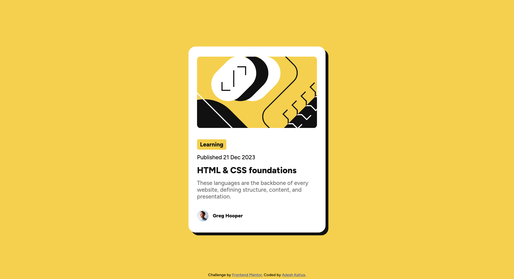

# Frontend Mentor - Blog preview card solution

This is a solution to the [Blog preview card challenge on Frontend Mentor](https://www.frontendmentor.io/challenges/blog-preview-card-ckPaj01IcS). Frontend Mentor challenges help you improve your coding skills by building realistic projects.

## Table of contents

- [Overview](#overview)
  - [The challenge](#the-challenge)
  - [Screenshot](#screenshot)
  - [Links](#links)
- [My process](#my-process)
  - [Built with](#built-with)
  - [What I learned](#what-i-learned)
  - [Continued development](#continued-development)
  - [Useful resources](#useful-resources)

## Overview

### The challenge

Users should be able to:

- See hover and focus states for all interactive elements on the page

### Screenshot

### Links

- Solution URL: [Blog preview Card](https://www.frontendmentor.io/solutions/blog-preview-card-using-html-and-css-with-flexbox-and-grid-VNjlUhC7PY)
- Live Site URL: [Blog preview Card](https://blog-preview-card-main-jade-alpha.vercel.app/)

## My process

### Built with

- Semantic HTML5 markup
- CSS custom properties
- Flexbox
- CSS Grid

### What I learned

- Learned about how do you even spread elements so that there is no-white space between them.
- Learned the need for variable fonts and using them in a css file.

### Continued development

- Want to learn how to use `calc()` function to scale content dynamically.

### Useful resources

- [Google](https://www.google.com) - Standard queries
- [Stack Overflow](https://www.stackoverflow.com) - Queries related to flexbox and grid.
